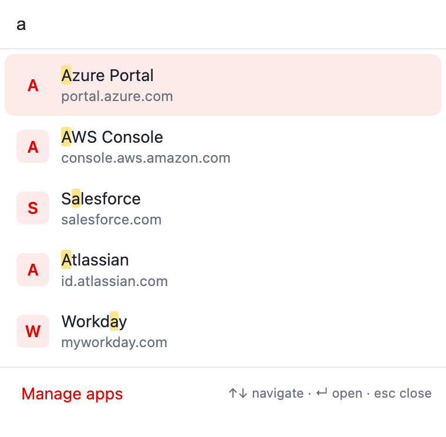
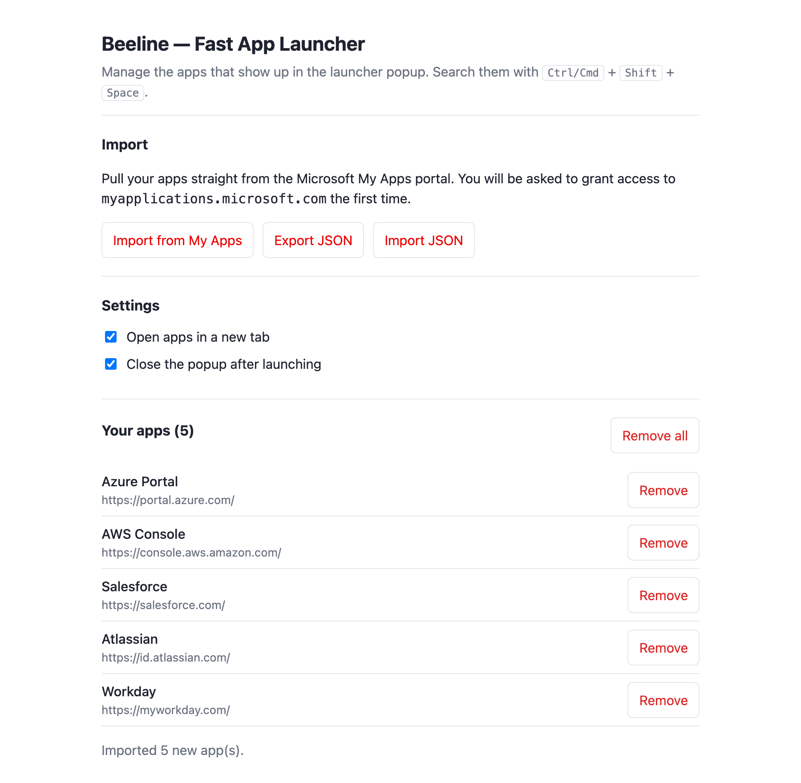

# Beeline — Fast App Launcher

A fast, keyboard-first launcher for your **Microsoft My Apps / Entra** single
sign-on apps — a lightweight, modern alternative to the official _My Apps Secure
Sign-in_ extension's app portal.

Press **`Ctrl/Cmd` + `Shift` + `Space`**, type a few letters, hit **Enter** —
the app opens through your existing SSO. No backend, no telemetry, no waiting.

> **Scope.** Beeline is an app _launcher_. It does **not** replicate Entra's
> password vaulting / credential auto-fill — that backend is Microsoft-proprietary
> and can't be cloned client-side. Apps open via their normal SSO flow.

## Table of Contents

- [Features](#features)
- [Visuals](#visuals)
- [Installation](#installation)
- [Usage](#usage)
- [Development](#development)
- [Architecture](#architecture)
- [Publishing](#publishing)
- [Privacy](#privacy)
- [Conventions](#conventions)
- [Author & License](#author--license)

## Features

- ⚡ **Instant** — pure, dependency-free logic renders the list straight from
  local storage; no network round-trip on open.
- ⌨️ **Keyboard-first** — fuzzy search, `↑`/`↓` to navigate, `Enter` to launch,
  `Esc` to clear/close. Matched letters are highlighted.
- 🧠 **Learns your habits** — frequently and recently launched apps float to the
  top.
- 📥 **Import from My Apps** — one click pulls your tiles from
  `myapplications.microsoft.com` (host permission requested only then), plus
  manual add and JSON import/export.
- 🔒 **Least privilege** — only `storage` + `scripting`; https-only; nothing
  leaves your browser.

## Visuals

### Launcher popup



### Manage apps



The icon is a generated rounded gradient tile (`npm run icons`). The 1280×800
store screenshot lives in [docs/store/](docs/store/screenshot-1280x800.png).

## Installation

### From source (development)

```bash
git clone git@github.com:sapn95/myapps-launcher.git
cd myapps-launcher
npm install
npm run build
```

Then in Chrome: `chrome://extensions` → enable **Developer mode** → **Load
unpacked** → select the `dist/` folder.

### From the Chrome Web Store

Once published, install it from the store listing (link TBD after first submit).

## Usage

1. Open **Manage apps** (the extension opens it automatically on first install).
2. Click **Import from My Apps** (sign in to My Apps first), or **Add an app**
   manually, or **Import JSON**.
3. Open the launcher with the toolbar button or **`Ctrl/Cmd` + `Shift` +
   `Space`**, type, and press **Enter**.

Settings let you choose new-tab vs. current-tab and whether the popup closes
after launching.

## Development

```bash
npm install
npm run lint            # eslint
npm run format          # prettier --write
npm test                # vitest
npm run test:coverage   # vitest + coverage gate (src/lib)
npm run icons           # regenerate src/icons/*.png
npm run build           # -> dist/
npm run package         # -> dist/ + myapps-launcher-vX.Y.Z.zip
npm run ci              # lint + format:check + coverage + build
```

The unit-tested core lives in [`src/lib/`](src/lib/); the UI glue
(`popup`, `options`, `background`) is intentionally thin. CI runs on every push
and PR via [`.github/workflows/ci.yml`](.github/workflows/ci.yml).

## Architecture

See [docs/architecture.md](docs/architecture.md) for the component diagram,
storage layout, and design rationale.

## Publishing

Tagging `vX.Y.Z` triggers [`.github/workflows/release.yml`](.github/workflows/release.yml),
which builds, tests, creates a GitHub release, and publishes to the Chrome Web
Store (once the four store secrets are set). Full setup — including the one-time
manual first submission and how to generate the OAuth credentials — is in
[docs/publishing.md](docs/publishing.md).

## Privacy

Beeline stores your app list and settings in Chrome storage (synced to your
Google account if Chrome sync is on) and launch counts locally. It makes **no
external network calls** of its own and contains **no analytics or telemetry**.
The only host access is `myapplications.microsoft.com`, requested on demand to
import your own app tiles. Full details are in [PRIVACY.md](PRIVACY.md).

## Conventions

- **Commits:** Conventional Commits + SemVer.
- **Quality gates:** pre-commit secret scanning (ggshield, detect-private-key,
  detect-aws-credentials), ESLint, and Prettier.
- **Tests:** Vitest with a coverage gate on `src/lib/`, plus source security
  checks (no hardcoded keys, no plain-http URLs, no disabled TLS).
- **Docs:** kept in-repo (README + `docs/`); commit history is the record (no
  `CHANGELOG.md`).

## Author & License

Created by Sebastian Winterberger ([@sapn95](https://github.com/sapn95)).
Licensed under the [MIT License](LICENSE).
