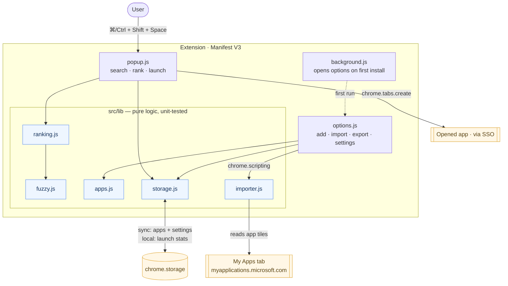
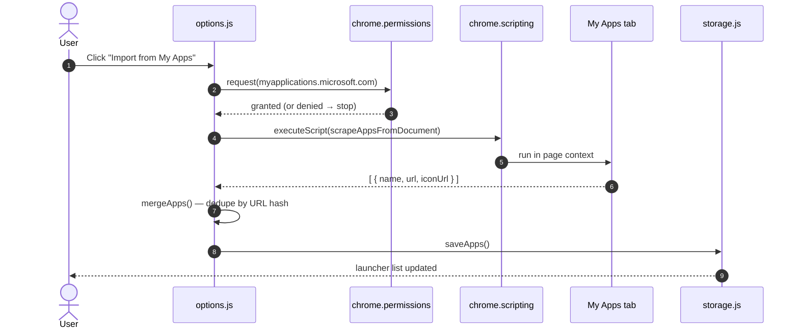

# Architecture

Beeline is a Manifest V3 Chrome extension with **no runtime dependencies** and
no build-time bundler — the source under `src/` is the artifact. `npm run build`
just copies `src/` into `dist/` and stamps the manifest version.

> Diagrams use Mermaid — it renders natively on GitHub.

## Components

## Import flow

## Why this shape

- **The `src/lib/` core is pure** — no `chrome` APIs or DOM globals in the hot
  path — so it is fully unit-testable and carries the coverage gate (see
  `vitest.config.js`). UI glue (`popup`, `options`, `background`) is thin and
  verified by load-unpacked smoke testing.
- **Least privilege.** The manifest requests only `storage` and `scripting`.
  Access to `myapplications.microsoft.com` is an _optional_ host permission,
  requested the moment the user clicks **Import from My Apps** and never before.
- **The importer is injected, not bundled.** `scrapeAppsFromDocument` is passed
  to `chrome.scripting.executeScript({ func })`, so it must stay self-contained
  (no imports). It is exported only so the unit test can run it against a jsdom
  fixture.
- **Stable identity.** Each app's id is an FNV-1a hash of its canonical URL, so
  re-importing never duplicates an app and launch stats survive re-imports.

## Storage layout

| Key        | Area    | Contents                            | Why                                      |
| ---------- | ------- | ----------------------------------- | ---------------------------------------- |
| `apps`     | `sync`  | curated app list                    | follows the user across signed-in Chrome |
| `settings` | `sync`  | open-in-new-tab, close-after-launch | small, user-level                        |
| `stats`    | `local` | per-app `{count, lastLaunched}`     | high-write, device-specific              |

> NOTE: `chrome.storage.sync` has an ~8 KB-per-item / ~100 KB-total quota. For a
> very large app list, move `apps` to `local` in `src/lib/storage.js`.

## Data flow: ranking

`rankApps(apps, query, now, stats)` scores each app as
`fuzzyScore(name) + usageBoost(stats)`, falling back to a (weighted) host match
when the name doesn't match, then sorts best-first with an alphabetical
tiebreak. Matched character positions are returned so the popup can `<mark>`
them.
